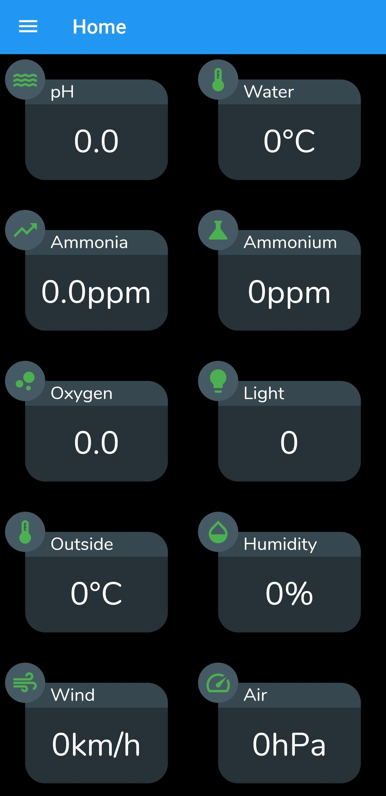
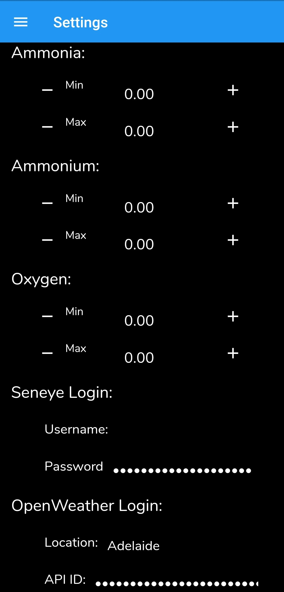

# Aquaponics Monitor

A frontend display of a collection of data from the Seneye aquaponics monitor and Openweather APIs
  
The app will not display any data on first load, your own personal API keys will have to be inputted via the settings page
 
After inputting your API keys, return to the home screen and refresh with scroll up to refresh. Currently the app doesn't have automatic reload although it will reload upon app opening.
  
Notifications are an upcoming feature, to notify you when any Seneye values become out of range (defined in settings)

# Screenshots

